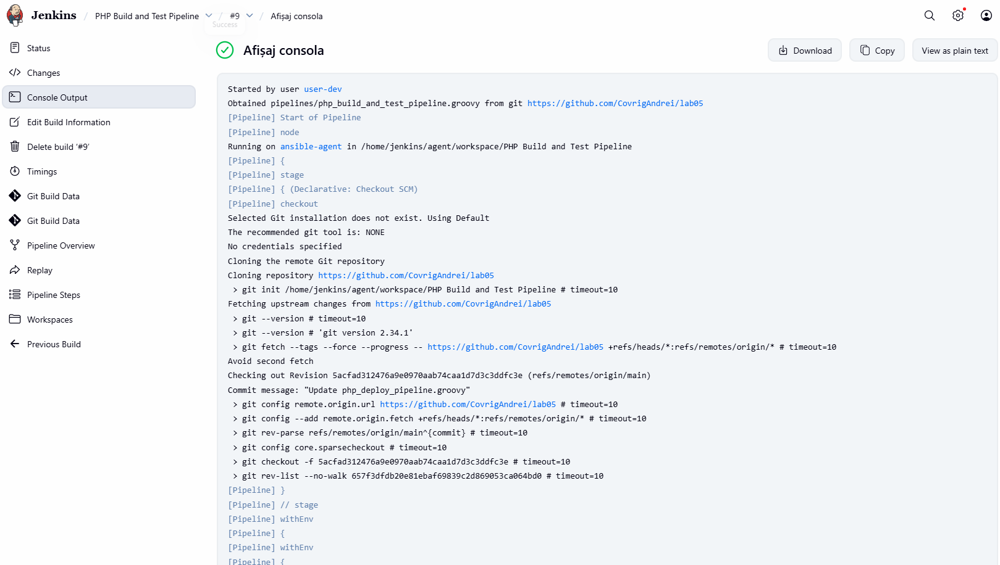
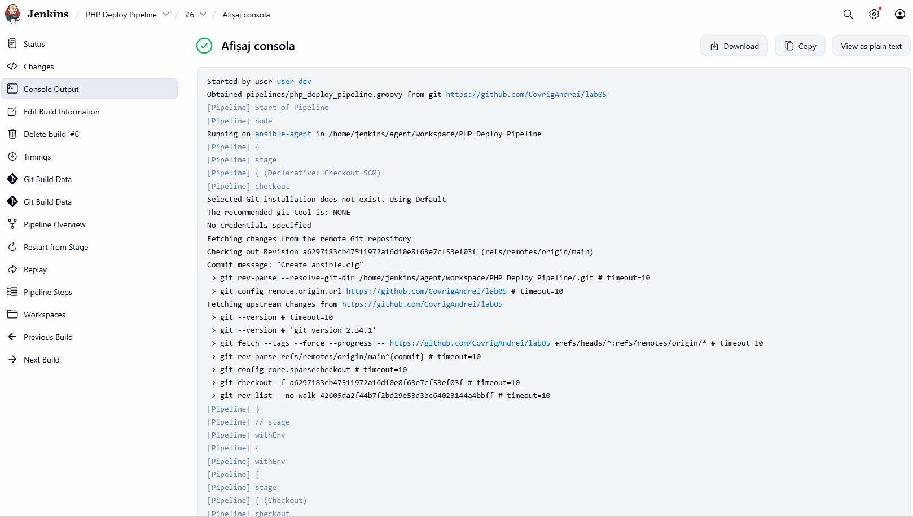
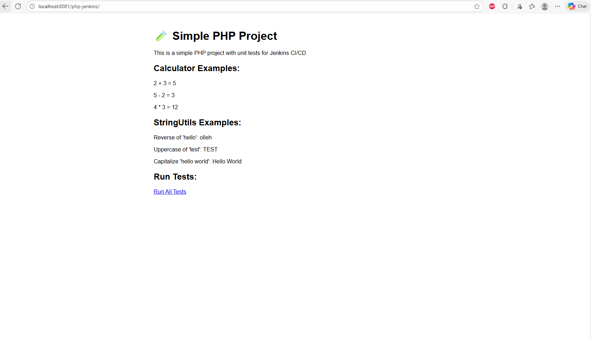

# Lucrare de laborator Nr.5: Configurarea unui server cu Ansible
# Covrig Andrei, grupa I2301
# 2025

## Scopul lucrării
Învățarea creării de playbook-uri Ansible pentru automatizarea configurației serverelor.


## Condiții prealabile

Am început prin a crea în repository-ul meu GitHub un nou folder numit `lab05`. Am copiat toate fișierele din `lab04` în acest folder nou.
De asemenea, am verificat că aveam instalate Docker și Docker Compose.

## Sarcina

Crearea fișierului `compose.yaml` și definirea în el a serviciilor necesare.

### 1. Instalarea și Configurarea Jenkins

Am creat un serviciu `jenkins-controller` în fișierul `compose.yaml`:
```yaml
services:
  jenkins-controller:
    image: jenkins/jenkins:lts
    container_name: jenkins-controller
    ports:
      - "8080:8080"
      - "50000:50000"
    volumes:
      - jenkins_home:/var/jenkins_home
    networks:
      - jenkins-network

volumes:
  jenkins_home:
  jenkins_agent_volume:

networks:
  jenkins-network:
    driver: bridge
```

Am lansat containerul Jenkins folosind Docker Compose:

```bash
docker-compose up -d
```
Apoi am accesat interfața Jenkins la adresa `http://localhost:8080`.

Am obținut parola de deblocare rulând:

```bash
docker logs jenkins-controller
```
și am urmat instrucțiunile de configurare inițială din browser.

### 2. Configurarea SSH Agent

Am creat un fișier `Dockerfile.ssh_agent` pentru agentul SSH, cu următorul conținut: 

```dockerfile
FROM jenkins/ssh-agent

# Instalează PHP-CLI
RUN apt-get update && apt-get install -y php-cli
```

Am creat un folder `secrets` în rădăcina proiectului pentru cheile SSH, rulând comenzile:

```bash
mkdir secrets
cd secrets
ssh-keygen -f jenkins_agent_ssh_key
```

și am configurat Jenkins să folosească aceste chei.

Am adăugat un serviciu `ssh-agent` în `compose.yaml`, cu următorul conținut: 

```yaml
  ssh-agent:
    build:
      context: .
      dockerfile: Dockerfile
    container_name: ssh-agent
    environment:
      - JENKINS_AGENT_SSH_PUBKEY=${JENKINS_AGENT_SSH_PUBKEY}
    volumes:
      - jenkins_agent_volume:/home/jenkins/agent
    depends_on:
      - jenkins-controller
    networks:
      - jenkins-network
```

Am creat fișierul `.env` în rădăcina proiectului și am adăugat următoarea linie:

```ini
JENKINS_AGENT_SSH_PUBKEY=conținutul_cheii_publice
```

### 3. Crearea Agentului Ansible

Am creat fișierul `Dockerfile.ansible_agent` pentru agentul Ansible bazat pe Ubuntu, cu următorul conținut: 

```dockerfile
FROM ubuntu:22.04
ENV DEBIAN_FRONTEND=noninteractive

RUN apt-get update && apt-get install -y \
    openssh-server \
    python3 python3-pip \
    git sshpass \
    openjdk-17-jdk \
    php-cli php-xml php-mbstring unzip curl \
    && pip3 install --no-cache-dir ansible \
    && mkdir /var/run/sshd

RUN curl -sS https://getcomposer.org/installer | php \
    && mv composer.phar /usr/local/bin/composer \
    && chmod +x /usr/local/bin/composer

RUN useradd -m -s /bin/bash jenkins

RUN mkdir -p /home/jenkins/.ssh \
    && chown -R jenkins:jenkins /home/jenkins/.ssh \
    && chmod 700 /home/jenkins/.ssh

COPY secrets/ansible_agent_ssh_key.pub /home/jenkins/.ssh/authorized_keys

RUN chown jenkins:jenkins /home/jenkins/.ssh/authorized_keys \
    && chmod 600 /home/jenkins/.ssh/authorized_keys

COPY ansible/ansible.cfg /etc/ansible/ansible.cfg

EXPOSE 22

CMD ["/usr/sbin/sshd","-D"]
```

Am creat chei SSH pentru integrarea Jenkins cu agentul Ansibl, rulând comenzile:

```bash
cd secrets
ssh-keygen -f ansible_agent_ssh_key
```

și am configurat Jenkins să folosească aceste chei.

Am adăugat serviciul `ansible-agent` în fișierul `compose.yaml`, cu următorul conținut: 

```yaml
  ansible-agent:
    build:
      context: .
      dockerfile: Dockerfile.ansible_agent
    container_name: ansible-agent
    volumes:
      - ./ansible:/ansible:rw 
      - ./secrets/ansible_to_test_ssh_key:/secrets/ansible_to_test_ssh_key:ro
    depends_on:
      - jenkins-controller
    networks:
      - jenkins-network
```

### 4. Crearea Serverului de Test

Am creat un fișier `Dockerfile.test_server` cu configurația serverului de test bazat pe Ubuntu, cu următorul conținut: 

```dockerfile
FROM ubuntu:22.04
ENV DEBIAN_FRONTEND=noninteractive

RUN apt-get update && apt-get install -y openssh-server sudo apache2 php libapache2-mod-php php-cli php-mbstring php-xml && \
    mkdir /var/run/sshd

RUN useradd -m -s /bin/bash ansible && echo "ansible ALL=(ALL) NOPASSWD:ALL" > /etc/sudoers.d/ansible
RUN mkdir -p /home/ansible/.ssh && chown -R ansible:ansible /home/ansible

RUN mkdir -p /home/ansible/.ssh \
    && chown ansible:ansible /home/ansible/.ssh \
    && chmod 700 /home/ansible/.ssh

COPY secrets/ansible_to_test_ssh_key.pub /home/ansible/.ssh/authorized_keys

RUN chown ansible:ansible /home/ansible/.ssh/authorized_keys \
    && chmod 600 /home/ansible/.ssh/authorized_keys

RUN apt-get update && apt-get install -y rsync

EXPOSE 22 80
CMD ["/usr/sbin/sshd", "-D"]
```

Am creat un utilizator ansible pe serverul de test și am configurat SSH pentru conectarea la server ca acest utilizator folosind cheile SSH create anterior.

Am inclus serviciul `test-server`în configurația `compose.yaml`, cu următorul conținut: 

```yaml
test-server:
    build:
      context: .
      dockerfile: Dockerfile.test_server
    container_name: test-server
    ports:
      - "8081:80"
    networks:
      - jenkins-network

volumes:
  jenkins_home:
  jenkins_agent_volume:

networks:
  jenkins-network:
    driver: bridge
```

### 5. Crearea Playbook-ului Ansible pentru Configurarea Serverului de Test

Am creat un folder `ansible`. În acest folder, am definit un fișier de inventar `hosts.ini` unde am specificat parametrii de conexiune la serverul de test.

```ini
[testserver]
test-server ansible_host=test-server ansible_user=root ansible_ssh_private_key_file=/secrets/ansible_to_test_ssh_key ansible_python_interpreter=/usr/bin/python3
```
Am creat un playbook Ansible `setup_test_server.yml` care execută următoarele task-uri pe serverul de test:

1. Instalarea și configurarea Apache2.

2. Instalarea și configurarea PHP și a extensiilor necesare.

3. Configurarea virtual host-ului Apache pentru proiectul PHP.

```yaml
- name: Configure test server for PHP project
  hosts: testserver
  vars:
    ansible_ssh_common_args: '-o StrictHostKeyChecking=no'
  become: true
  tasks:
    - name: Update apt cache
      apt:
        update_cache: yes
        cache_valid_time: 3600

    - name: Install apache and php packages
      apt:
        name:
          - apache2
          - php
          - libapache2-mod-php
          - php-cli
          - php-mbstring
          - php-xml
        state: present

    - name: Ensure apache is started and enabled
      service:
        name: apache2
        state: started
        enabled: yes

    - name: Create web root directory
      file:
        path: /var/www/php-jenkins
        state: directory
        owner: www-data
        group: www-data
        mode: '0755'

    - name: Copy simple index.php placeholder (if repo not yet copied)
      copy:
        dest: /var/www/php-jenkins/index.php
        content: |
          <?php
          echo "PHP App deployed via Ansible";
        owner: www-data
        group: www-data
        mode: '0644'

    - name: Create Apache virtual host for project
      copy:
        dest: /etc/apache2/sites-available/php-jenkins.conf
        content: |
          <VirtualHost *:80>
            ServerAdmin webmaster@localhost
            DocumentRoot /var/www/php-jenkins
            <Directory /var/www/php-jenkins>
              AllowOverride All
              Require all granted
            </Directory>
            ErrorLog ${APACHE_LOG_DIR}/php-jenkins-error.log
            CustomLog ${APACHE_LOG_DIR}/php-jenkins-access.log combined
          </VirtualHost>
      notify: reload apache

  handlers:
    - name: reload apache
      service:
        name: apache2
        state: reloaded
```

### 6. Pipeline pentru Construirea și Testarea Proiectului PHP

Am creat un folder `pipelines`.

Am creat un pipeline Jenkins pentru construirea și testarea proiectului PHP folosind agentul SSH. Pentru aceasta, am creat un fișier `php_build_and_test_pipeline.groovy` în folderul `pipelines`, cu următorul conținut: 

```groovy
pipeline {
    agent { label 'ansible-agent' }

    environment {
        PHP_PROJECT_DIR = 'php-jenkins'
    }

    stages {
        stage('Checkout PHP project') {
            steps {
                dir("${env.PHP_PROJECT_DIR}") {
                    git url: 'https://github.com/CovrigAndrei/php-jenkins.git', branch: 'main'
                }
            }
        }

        stage('Install PHP Dependencies') {
            steps {
                dir("${env.PHP_PROJECT_DIR}") {
                    sh 'composer install --no-interaction --prefer-dist'
                }
            }
        }

        stage('Run PHP Tests') {
            steps {
                dir("${env.PHP_PROJECT_DIR}") {
                    sh './vendor/bin/phpunit --colors=always tests/'
                }
            }
        }

    post {
        success {
            echo 'PHP Build & Test Pipeline finished successfully!'
        }
        failure {
            echo 'PHP Build & Test Pipeline failed. Verificați logurile!'
        }
        always {
            echo 'Pipeline-ul s-a terminat.'
        }
    }
}
```

Pipeline-ul include următoarele etape:

1. Clonarea repository-ului cu proiectul PHP.

2. Instalarea dependințelor proiectului folosind Composer.

3. Rularea testelor unitare folosind PHPUnit.

4. Raportarea rezultatelor testelor.



### 7. Pipeline pentru Configurarea Serverului de Test folosind Ansible

Am creat un pipeline Jenkins pentru configurarea serverului de test folosind agentul Ansible. Pentru aceasta, am creat un fișier `ansible_setup_pipeline.groovy` în folderul `pipelines`, cu următorul conținut: 

```groovy
pipeline {
  agent { label 'ansible-agent' }
  environment {
    ANSIBLE_DIR = '/ansible'
    REPO_URL = 'https://github.com/CovrigAndrei/lab05.git'
  }
  stages {
    stage('Checkout') {
      steps {
        checkout([$class: 'GitSCM', branches: [[name: '*/main']], userRemoteConfigs: [[url: env.REPO_URL]]])
      }
    }
    stage('Run Ansible Playbook') {
      steps {
        sh """
          ansible-playbook -i ${ANSIBLE_DIR}/hosts.ini \
          ${ANSIBLE_DIR}/setup_test_server.yml \
          --private-key /secrets/ansible_to_test_ssh_key \
          -u ansible --ssh-extra-args='-o StrictHostKeyChecking=no'
        """
      }
    }
  }
}
```

Pipeline-ul include următoarele etape:

1. Clonarea repository-ului cu playbook-ul Ansible.

2. Executarea playbook-ului Ansible pentru configurarea serverului de test.


### 8. Pipeline pentru Deploy-ul Proiectului PHP pe Serverul de Test

Am creat un pipeline Jenkins pentru deploy-ul proiectului PHP pe serverul de test. Pentru aceasta, am creat un fișier `php_deploy_pipeline.groovy` în folderul `pipelines`, cu următorul conținut: 

```groovy
pipeline {
  agent { label 'ansible-agent' }
  environment {
    REPO_URL = 'https://github.com/CovrigAndrei/php-jenkins.git'
    ANSIBLE_DIR = '/ansible'
  }
  stages {
    stage('Checkout') {
      steps { checkout([$class: 'GitSCM', branches: [[name: '*/main']], userRemoteConfigs: [[url: env.REPO_URL]]]) }
    }
    stage('Copy project to test server') {
      steps {
        sh '''
          ansible -i ${ANSIBLE_DIR}/hosts.ini testserver -m synchronize -a "src=. dest=/var/www/php-jenkins/ delete=yes" --private-key /secrets/ansible_to_test_ssh_key -u ansible || true
        '''
      }
    }
    stage('Set permissions') {
      steps {
        sh "ansible -i ${ANSIBLE_DIR}/hosts.ini testserver -m file -a \"path=/var/www/php-jenkins owner=www-data group=www-data recurse=yes\" --private-key /secrets/ansible_to_test_ssh_key -u ansible || true"
      }
    }
  }
}
```

Pipeline-ul include următoarele etape:

1. Clonarea repository-ului cu proiectul PHP.

2. Copierea fișierelor proiectului pe serverul de test.



### 9. Testarea Proiectului PHP

Am deschis un browser web și am navigat la adresa serverului de test pentru a mă asigura că proiectul PHP a fost lansat cu succes și funcționează corect.



### 10. Crearea raportului

Am creat în directorul `lab05` fișierul `readme.md` care conține descrierea pas cu pas a executării proiectului.

## Răspunsuri la întrebări:

1. Care sunt avantajele utilizării Ansible pentru configurarea serverelor?

Ansible este valoros pentru configurarea serverelor deoarece elimină nevoia de agenți instalați pe mașinile gestionate, bazându-se doar pe conexiuni SSH. Playbook-urile sale sunt idempotente, ceea ce înseamnă că pot fi rulate de mai multe ori fără a produce modificări inutile asupra sistemului. În plus, folosirea YAML face ca instrucțiunile să fie clare și ușor de înțeles, iar flexibilitatea platformei îi permite să fie utilizată nu doar pentru configurarea serverelor, ci și pentru provisioning, deployment și orchestrarea unor procese complexe.

2. Ce alte module Ansible există pentru managementul configurației?

Pe lângă modulele apt, command, service, Ansible oferă și alte instrumente esențiale pentru managementul configurației. Modulul file permite crearea de directoare, fișiere. Modulele lineinfile și blockinfile sunt utile pentru modificarea selectivă a fișierelor de configurare, fie prin adăugarea, ștergerea sau înlocuirea unor linii, fie prin inserarea unor blocuri întregi de text. Cu ajutorul modulelor user și group se pot gestiona utilizatorii și grupurile la nivel de sistem, ceea ce simplifică administrarea accesului. În plus, modulele copy și synchronize facilitează transferul rapid de fișiere de pe mașina de control către serverul destinație, asigurând o distribuție eficientă a resurselor.

3. Ce probleme am întâmpinat la crearea playbook-ului Ansible și cum le-am rezolvat?

La crearea playbook-ului Ansible am întâmpinat diverse probleme de configurare. Am avut dificultăți inițiale legate de stabilirea conexiunii SSH între containere, pe care le-am depășit prin verificarea amănunțită a metodelor de autentificare și a permisiunilor de acces. De asemenea, s-a manifestat și o problemă de idempotență în configurarea serviciilor, pe care am rezolvat-o prin implementarea unor mecanisme care asigură rularea repetată fără erori.

## Concluzii

În cadrul acestei lucrări de laborator, am implementat cu succes o infrastructură CI/CD utilizând Jenkins împreună cu Ansible și Docker Compose. Am învățat să definesc servicii complexe în compose.yaml pentru un controler Jenkins, un agent SSH, un agent Ansible personalizat și un server de test.

## Bibliografie

1. [Pipeline as Code, Jenkins](https://www.jenkins.io/doc/book/pipeline/pipeline-as-code)
2. [edeshina, Jenkins Scripted Pipeline: How to Use, Habr, 2023-01-10](https://habr.com/ru/companies/slurm/articles/709804)
3. [Ansible Documentation](https://www.jenkins.io/solutions/pipeline)
